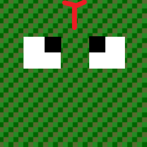
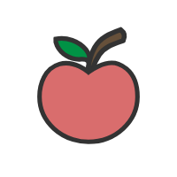

# Snake Game
***Snake Game*** is a game where the player uses the **Arrow Keys**(⬆️⬇️⬅️➡️) to direct the ***Snake***
towards the ***Apple*** the player increases their score by consecutively eating Apples, which makes the Snake grow longer. The player loses when colliding with the sides of the ***Board*** (the ***Walls***) or the Snake's tail.
> **The players compete to score as high as possible before losing.** 

>*I personally chose this game because it was my father's favorite game, he used to play it on this old Nokia device that he still had up to 2021 before passing away from COVID-19, in a way this is a tribute to him.* 

## **Main Elements of the game**

### 1. Board
_________
 The Board will be rendered and the Walls will dynamically be put on the sides *(see screenshot above)*, the player will lose if the Snake hits the Walls

### 2. Snake
__________________________
the main character in the game that the player will control with the **Arrow Keys**(⬆️⬇️⬅️➡️) is the Snake doesn't stop moving, so the player has to keep directing it away from the Walls and the Snake's tail

#### 3. Apple 
________
the main objective is for the player to reach the Apple and capture it with the Snake.
A new Apple appears on the screen whenever one is eaten. the player then has to path towards the new one to capture it

## **Technologies and Skills used**
#             

# **Play The Game Now! Press on the play button below**
#  

## **planning material**
For the initial planning material [Click here](https://docs.google.com/document/d/1KdzVdU4wa9pIRd8ItaUslJwcO0XZ_I8rpmsuNOFbUW0/edit)

## **Future Enhancements**
- high score implementation
- sound effects 
- confetti effect upon beating the high score 
- snake opens its mouth around the apple squares
- speed up when reaching certain checkpoints in score
- visual adjustments to snake and apple
- implementing how-to-play 
- implementing pause logic with button and keystroke
- adding animation to Apple appearing on board
- change the font to fit with the theme

# Attributions
### - Animations: [Animate.css](https://animate.style/)