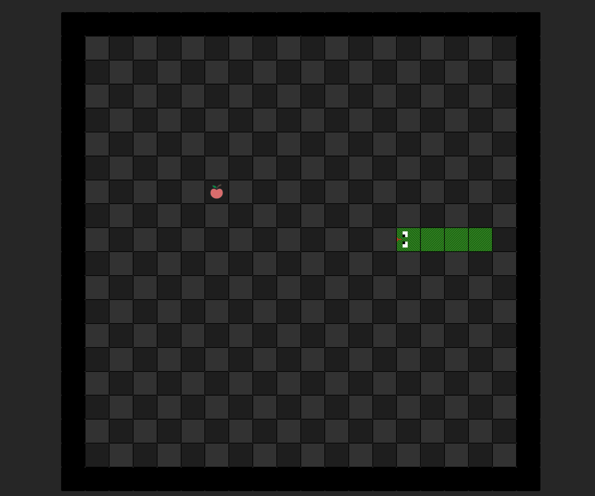

# Snake Game
***Snake Game*** is a game where the player uses the **Arrow Keys**(⬆️⬇️⬅️➡️) to direct the ***Snake***
towards the ***Apple*** the player increases their score by consecutively eating apples, which in turn makes the snake grow longer. The player loses when colliding with the sides of the board or the snakes tail.

> **the players compete being trying to score as high as they can before losing.** 

>*I personally chose this game because it was my fathers favorite game, he used to play it on this old nokia device that he still had up to 2021 before passing away from covid, in a way this is a tribute to him.* 

## Skills and Technologies used
   

# Play The Game Now!

## Press on the play button below
#  

https://img.shields.io/badge/JavaScript-323330?style=for-the-badge&logo=javascript&logoColor=F7DF1E
https://img.shields.io/badge/GIT-E44C30?style=for-the-badge&logo=git&logoColor=white

## planning material
For the initial planning material [Click here](https://docs.google.com/document/d/1KdzVdU4wa9pIRd8ItaUslJwcO0XZ_I8rpmsuNOFbUW0/edit)

# Attributions
### - Animations: [Animate.css](https://animate.style/)